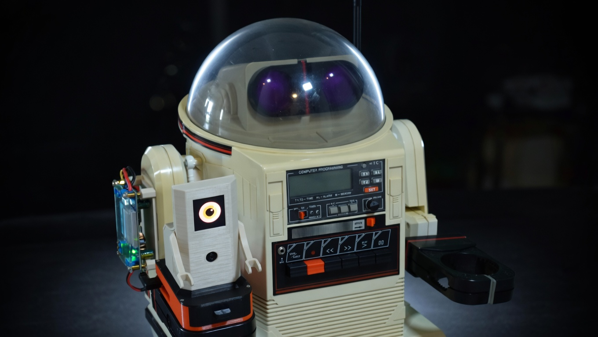

# OmniAI - Raspberry Pi AI Robot Control System



AI-powered robot control using Raspberry Pi 5, IMX500 AI Camera with **YOLO11 hardware-accelerated detection**, rule-based navigation, and real-time object detection.

## Features

- **Hardware-Accelerated AI**: YOLO11 runs directly on the IMX500 camera chip (~17ms inference, ~30fps)
- **Real-time Object Detection**: 80 COCO classes including people, animals, vehicles, household items
- **Rule-Based Navigation**: Instant position-math navigation — turn to face target, approach, stop when close
- **Tomy Omnibot Control**: Audio frequency-based robot control via Bluetooth
- **Web Dashboard**: Live MJPEG stream with bounding boxes, navigation log, and controls
- **Kids Dashboard**: Simplified colorful interface with mission buttons
- **Eye Display**: Animated OLED/TFT eye with expressions (happy, surprised, sleepy, angry)
- **Thread-Safe Camera**: Robust multi-threaded capture with proper resource management

## Hardware Requirements

- **Raspberry Pi 5** (8GB+ RAM, 16GB recommended)
- **Raspberry Pi AI Camera** (IMX500 with neural accelerator)
- **Tomy Omnibot** (optional - for robot control via audio tones)

## Quick Start

### 1. Fresh Pi OS Install

```bash
# Update system
sudo apt update && sudo apt full-upgrade -y

# Install IMX500 AI Camera support
sudo apt install imx500-all -y

# Install system dependencies
sudo apt install -y libcap-dev python3-dev python3-venv libportaudio2 portaudio19-dev

# Reboot
sudo reboot
```

### 2. Install YOLO11 Model

The YOLO11 model is included in the `imx500-models` package. Verify it exists:

```bash
ls /usr/share/imx500-models/imx500_network_yolo11n_pp.rpk
```

### 3. Setup Project

```bash
# Clone/copy to Pi
cd ~/omniai

# Create virtual environment (IMPORTANT: --system-site-packages for picamera2 access)
python3 -m venv venv --system-site-packages
source venv/bin/activate

# Install dependencies
pip install flask flask-cors flask-socketio requests ollama websocket-client python-socketio opencv-python sounddevice

# Optional: Set up Groq API key (for future LLM features like scene description)
# echo "GROQ_API_KEY=your_api_key_here" > .env
# Navigation uses rule-based math — no LLM needed
```

### 4. Run

```bash
# Test detection standalone (recommended first)
python test_detection.py
# Open https://omniai.local:8080

# Full dashboard with navigation and robot control
python dashboard.py --port 8080
```

Then open in a browser on the same network:

- Main dashboard: **https://omniai.local:8080/**
- Kids dashboard: **https://omniai.local:8080/kids**

`omniai.local` is the Pi's mDNS/Bonjour name (the hostname set during Pi OS
setup). If it doesn't resolve, use the Pi's IP from `hostname -I`. Accept
the self-signed TLS warning on first load.

## IMX500 AI Camera

The IMX500 is a **smart camera** with an on-chip neural network accelerator. Key points:

- **Model Upload**: Neural network firmware is uploaded directly to the camera chip
- **Hardware Inference**: Detection runs on dedicated AI silicon, NOT on Pi's CPU
- **Performance**: ~17ms inference time, ~30fps real-time detection
- **YOLO11**: Best accuracy for object detection (640x640 input, 80 COCO classes)

### How It Works

```
┌──────────────────────────────────────────────────────────────┐
│                     IMX500 AI Camera                         │
│  ┌─────────────┐    ┌─────────────┐    ┌─────────────────┐   │
│  │   Image     │───▶│  Neural Net │───▶│  Detection      │   │
│  │   Sensor    │    │  Processor  │    │  Results        │   │
│  └─────────────┘    └─────────────┘    └────────┬────────┘   │
└─────────────────────────────────────────────────┼────────────┘
                                                  │
                                                  ▼
┌──────────────────────────────────────────────────────────────┐
│                    Raspberry Pi 5                            │
│  ┌─────────────┐    ┌─────────────┐    ┌─────────────────┐   │
│  │  picamera2  │───▶│  Dashboard  │───▶│  Web Browser    │   │
│  │  (metadata) │    │  (Flask)    │    │(MJPEG+WebSocket)│   │
│  └─────────────┘    └─────────────┘    └─────────────────┘   │
└──────────────────────────────────────────────────────────────┘
```

## Project Structure

```
omniai/
├── dashboard.py              # Web dashboard with live stream + robot control
├── navigation.py             # Rule-based navigation engine (replaces LLM)
├── camera_capture.py         # Thread-safe camera capture with IMX500 support
├── object_detector.py        # Multi-backend detection (IMX500 YOLO11 default)
├── robot_executor.py         # Robot command executor (audio tones + speech)
├── audio_commander.py        # Audio frequency generator + speech (thread-safe)
├── eye_display.py            # Animated eye display (ST7735S TFT / SSD1351 OLED)
├── llm_command_generator.py  # LLM integration (kept for future scene description)
├── config.json               # Hardware and display configuration
├── speak_pi.sh               # Text-to-speech script (Pi - espeak + pw-play)
├── speak_phrase.sh           # Pre-recorded phrase player (Pi)
├── speak.sh                  # Text-to-speech script (macOS - for testing)
├── audio_phrases/            # Pre-recorded WAV files for fast speech
│   ├── hello.wav, yes.wav, no.wav, thanks.wav, omnibot.wav
├── logs/                     # Runtime logs (gitignored)
│   └── task.log              # Navigation decision log
├── util/                     # Test scripts and utilities
│   ├── test_eye_display.py   # Eye display test
│   ├── test_detection.py     # Camera/detection test
│   ├── test_oled_brightness.py # OLED brightness calibration
│   ├── generate_certs.sh     # SSL certificate generator
│   └── start.sh              # Quick start script
├── CLAUDE.md                 # Technical reference for Claude Code
└── README.md                 # This file
```

## Detection Models

| Model | File | Input | Speed | Accuracy |
|-------|------|-------|-------|----------|
| **YOLO11 nano** | `imx500_network_yolo11n_pp.rpk` | 640x640 | Good | **Best** |
| YOLOv8 nano | `imx500_network_yolov8n_pp.rpk` | 640x640 | Good | Good |
| MobileNet SSD | `imx500_network_ssd_mobilenetv2_fpnlite_320x320_pp.rpk` | 320x320 | **Fastest** | Good |
| NanoDet Plus | `imx500_network_nanodet_plus_416x416_pp.rpk` | 416x416 | Good | Good |
| EfficientDet | `imx500_network_efficientdet_lite0_pp.rpk` | Various | Medium | Good |

## Tomy Omnibot Audio Control

The robot is controlled via audio frequency tones:

| Command | Frequency |
|---------|-----------|
| Forward | 1614 Hz |
| Backward | 2013 Hz |
| Left | 2208 Hz |
| Right | 1811 Hz |
| Speaker On | 1422 Hz |
| Speaker Off | 4650 Hz |

Connect the Pi's audio output to the Omnibot's cassette input (via audio jack or Bluetooth).

## Speech Features

The robot can speak using text-to-speech or pre-recorded phrases.

### Pre-recorded Phrases (Fast)
Pre-generated WAV files for instant playback:
| Phrase | Description |
|--------|-------------|
| `hello` | "Hello" greeting |
| `yes` | "Yes" affirmative |
| `no` | "No" negative |
| `thanks` | "Thank you" |
| `omnibot` | "Hello, I am Omnibot" intro |
| `ready` | "Ready to go" |
| `goodbye` | "Goodbye" |
| `found_it` | "I found it" |
| `oops` | "Oops" |
| `sorry` | "Sorry" |
| `okay` | "Okay" |

To regenerate missing phrase WAVs on the Pi:
```bash
~/omniai/util/generate_phrases.sh   # uses espeak-ng -a 200, skips existing files
git add audio_phrases/*.wav && git commit -m 'Add phrase WAVs'
```

### Text-to-Speech (Flexible)
Any text can be spoken via espeak-ng (slower than pre-recorded).

### Speech Sequence
1. **Speaker On tone** (1422 Hz) - Enables robot's speaker relay
2. **Audio playback** - Speech or WAV file via Bluetooth
3. **Speaker Off tone** (4650 Hz) - Disables relay, stops audio

### Bluetooth Audio Setup
The Pi sends audio via Bluetooth to the robot's speaker:
```bash
# Pair Bluetooth speaker/robot
bluetoothctl
> scan on
> pair XX:XX:XX:XX:XX:XX
> trust XX:XX:XX:XX:XX:XX
> connect XX:XX:XX:XX:XX:XX
```

## Eye Display (ST7735S TFT / SSD1351 OLED)

Animated robot eye on ST7735S 1.8" TFT (128x160) or SSD1351 1.5" OLED (128x128). Configurable via `config.json`.

### Wiring

| ST7735S Pin | Raspberry Pi |
|-------------|--------------|
| VCC | 3.3V |
| GND | GND |
| SCL | GPIO11 (SCLK) |
| SDA | GPIO10 (MOSI) |
| RES | GPIO25 |
| DC | GPIO24 |
| CS | GPIO8 (CE0) |
| BLK | 3.3V |

### Setup
```bash
# Enable SPI
sudo raspi-config  # Interface Options -> SPI -> Enable

# Install libraries
pip install st7735 gpiodevice

# Test display
python util/test_eye_display.py
```

### Display Configuration
- **Mode**: Portrait (128x160)
- **Rotation**: 0
- **Offsets**: left=2, top=1

### Expressions


| Expression | Description |
|------------|-------------|
| `normal` | Default relaxed eye |
| `happy` | Dilated pupil, curved smile |
| `surprised` | Wide eye, small pupil |
| `sleepy` | Half-closed eyelids |
| `angry` | Angled eyebrow |
| `look_left/right/up/down` | Pupil tracking |

Regenerate the GIF with `python3 util/render_eye_gif.py` (runs headless; no Pi required).

### Testing Expressions

The eye reacts automatically to robot activity:

| Trigger | Expression | How to Test |
|---------|------------|-------------|
| Person detected | Happy | Stand in front of the camera |
| Cat/dog detected | Surprised | Show it a cat or dog (or a picture) |
| Left command | Look left | Press left button on dashboard |
| Right command | Look right | Press right button on dashboard |
| Forward command | Look up | Press forward button |
| Backward command | Look down | Press backward button |
| Speech command | Blink + Happy | Press "Hello" or other speech buttons |
| 30s inactivity | Sleepy | Wait with nothing happening |
| Random | Blink | Automatic every 3-7 seconds |

### Integration
```python
from eye_display import EyeDisplay, eye_happy, eye_surprised

eye = EyeDisplay()
eye.start()

eye.set_expression(EyeDisplay.EXPR_HAPPY)
eye.look_at(0.5, 0)  # Look right
eye.blink()
```

## Dashboard Features

### Main Dashboard (`/`)
- **Live Camera Stream**: MJPEG with detection bounding boxes
- **Navigation Log**: Real-time decisions with color-coded actions
- **Detection History**: Rolling log of detected objects
- **Set Task / End Task**: Start and stop navigation missions
- **Describe Button**: LLM describes the scene and robot speaks it
- **Manual Robot Controls**: Movement buttons, patterns, speech
- **Speech Buttons**: Hello, Yes, No, Thanks (pre-recorded phrases)
- **Statistics**: Iterations, FPS, detection count, command count
- **Bluetooth Status**: Connection indicator

### Kids Dashboard (`/kids`)
- **Simplified Interface**: Large, colorful arcade buttons
- **Mission Buttons**: Find Human, Find Ball, Explore, Dance
- **What Do You See?**: Robot describes what it sees (LLM + speech)
- **End Mission**: Stop navigation without powering down
- **Big Direction Controls**: D-pad with emoji arrows
- **Robot Brain Panel**: Real-time view of what the robot is thinking
- **Say Hello**: Plays "Hello, I am Omnibot" greeting
- **Quiet Button**: 🔇 Speaker off for kids

## API Endpoints

| Endpoint | Method | Description |
|----------|--------|-------------|
| `/` | GET | Main dashboard UI |
| `/kids` | GET | Kid-friendly dashboard |
| `/stream` | GET | MJPEG video stream |
| `/api/start` | POST | Start AI system |
| `/api/stop` | POST | Stop AI system |
| `/api/command` | POST | Send robot command |
| `/api/task` | POST | Set navigation task (e.g., "Find the person") |
| `/api/task/end` | POST | End task without stopping system |
| `/api/describe` | POST | LLM describes the scene and robot speaks it |
| `/api/bluetooth` | GET | Bluetooth connection status |

### Robot Commands via `/api/command`
```json
// Movement
{"command": "forward"}
{"command": "backward"}
{"command": "left"}
{"command": "right"}
{"command": "stop"}

// Patterns
{"command": "dance"}
{"command": "circle"}

// Speech (text-to-speech)
{"command": "speakText(\"Hello world\")"}

// Speech (pre-recorded - faster)
{"command": "phrase(\"hello\")"}

// Speaker control
{"command": "speaker_off"}
```

## Navigation

The robot navigates using **rule-based position math** — no LLM required. This gives instant
decisions (~0ms) compared to the 15s latency with cloud LLMs.

### How It Works

1. Camera detects objects via IMX500 YOLO11 (80 COCO classes)
2. Navigation engine picks the highest-confidence target
3. Calculates target position relative to frame center
4. Issues ONE command per cycle: turn left, turn right, forward, or stop

```
Person LEFT of center  →  turn left (750ms)
Person CENTERED        →  forward (500ms)
Person RIGHT of center →  turn right (750ms)
Person fills >60%      →  stop (close enough)
```

### Why Rules Instead of LLM?

We tested cloud LLMs (Groq) for navigation and found they don't work for real-time robot control:

| | Rule-Based | LLM (Groq Llama 3.1 8B) | LLM (Groq Llama 3.3 70B) |
|--|-----------|--------------------------|--------------------------|
| **Latency** | ~0ms | ~15s per decision | ~15s per decision |
| **Accuracy** | Correct (uses bbox math) | Always returned "right" | Always returned "right" |
| **Behavior** | Approaches target, stops when close | Robot spins in circles | Robot spins in circles |

Both LLM models ignored the actual object position data in the prompt and always returned
`{"commands": ["right"]}` regardless of whether the person was left, center, or right of frame.
The 15-second API latency also made the dashboard unresponsive and the robot blind between decisions.

The rule-based engine uses actual bounding box coordinates — if the person's center pixel is
left of frame center, turn left; if centered, go forward; if filling >60% of frame, stop.
It makes correct decisions instantly every ~2 seconds.

The `llm_command_generator.py` module is kept in the repo for potential future features like
scene description or voice interaction, where latency is acceptable and position math isn't needed.

### Task Log

All navigation decisions are logged to `logs/task.log` for debugging:
```
NAV target=person (73%) pos=x:197 cx:345 frame_cx:320 | person CENTERED -> forward
NAV target=person (78%) pos=x:0 cx:140 frame_cx:320   | person LEFT -> turn left
NAV target=person (73%) pos=x:140 cx:346 frame_cx:320 | person fills 64% -> STOP
```

## Describe Scene (LLM)

The "Describe" button uses Groq's Llama 3.3 70B to describe what the robot sees in natural language, then speaks it through the robot's speaker. This is the one place the LLM shines, since latency is acceptable for a one-shot description and you actually need language understanding.

```
Press "Describe" -> "I see a person and a keyboard."
```

Requires `GROQ_API_KEY` in `.env`. Without it, falls back to a simple list: "I can see 3 things: person, keyboard, laptop."

The response is kept short (under 10 words) and sanitized for the text-to-speech engine. The LLM is not used for navigation (see Why Rules Instead of LLM above).

## Troubleshooting

### YOLO model not found
```bash
# Reinstall the models package
sudo apt install --reinstall imx500-models
```

### Camera not working
```bash
rpicam-hello -t 5s
vcgencmd get_camera
```

### Detection not showing objects
1. Run `python test_detection.py` first to verify hardware works
2. Check confidence threshold (default 0.3 = 30%)
3. Ensure good lighting - AI cameras need decent light

### Slow performance
- YOLO11 runs at ~30fps on IMX500 hardware
- If slower, check if running other processes
- Try MobileNet SSD for faster (but less accurate) detection

## Development

Primary development happens on local machine, deploy to Pi:

### Deploy via Git (recommended)
```bash
# From local machine: commit and push
git add . && git commit -m "your changes" && git push

# On the Pi: pull latest
ssh admin@omniai.local "cd /home/admin/omniai && git pull"
```

### Deploy via rsync (alternative)
```bash
rsync -avz --exclude='venv/' --exclude='__pycache__/' --exclude='*.pyc' \
    /path/to/omnibotAi/ admin@omniai.local:/home/admin/omniai/
```

### Starting the Dashboard
```bash
# On the Pi (works from any directory)
~/omniai/util/start.sh

# With options
~/omniai/util/start.sh --volume 0.7 --port 8080
```

`start.sh` runs `util/smoke_test.py` first — if imports, camera, or audio
fail, it exits non-zero and the dashboard never launches, so a broken build
doesn't flap systemd.

### Running as a systemd service

For auto-start on boot and automatic restart on crash, install the
`omniai.service` unit:

```bash
# One-time install on the Pi
~/omniai/util/install_service.sh
```

The installer copies `util/omniai.service` to `/etc/systemd/system/`,
reloads systemd, enables it at boot, and starts it. The unit sets
`Restart=on-failure` with a 5-second backoff and a 5-crash-in-2-minutes
rate limit. The dashboard itself calls `os._exit(1)` when the camera is
stale for 60+ seconds, so systemd restarts it cleanly.

Day-to-day commands — use the `util/service.sh` wrapper:

```bash
~/omniai/util/service.sh status      # systemctl status
~/omniai/util/service.sh restart     # restart after a pull
~/omniai/util/service.sh stop        # stop the dashboard
~/omniai/util/service.sh start       # start it again
~/omniai/util/service.sh tail        # journalctl -f (live logs)
~/omniai/util/service.sh logs        # last 10 min of logs
```

Or call `systemctl` / `journalctl` directly if you prefer.

stdout/stderr go to journald (rotation handled automatically). The task
log at `logs/task.log` rotates at 5MB with 3 backups.

### Health checks

`GET /healthz` (alias: `/health`) returns a JSON snapshot of camera FPS,
robot connection, eye animation, process uptime, and time since last
detection. It returns `503` when any subsystem is degraded, which makes
it easy to wire into external monitoring.

## Future: Custom Model Training

Currently using pre-trained YOLO11 with 80 COCO classes. The IMX500 ecosystem supports training custom models to recognize specific objects (e.g., "Mario's shoes" instead of generic "shoes").

See: [Streamline dataset creation for the Raspberry Pi AI Camera](https://www.raspberrypi.com/news/streamline-dataset-creation-for-the-raspberry-pi-ai-camera/)

### Available Tools

| Tool | Description | Link |
|------|-------------|------|
| **Brain Builder for AITRIOS** | No-code custom model training, needs only ~50 images | [Sony AITRIOS](https://info.aitrios.sony-semicon.com/developers-blog/build-custom-ai-models-for-raspberry-pi-ai-camera-zero-coding-required) |
| **Roboflow** | Dataset annotation/labeling, exports to YOLOv8 format | [roboflow.com](https://roboflow.com) |
| **imx500_zoo** | Command-line training with NanoDet | [Hackster Tutorial](https://www.hackster.io/541341/how-to-create-a-custom-object-detection-ai-model-pt-1-f7203e) |
| **Edge-MDT** | Model conversion and quantization toolkit | [Sony Developer Docs](https://www.aitrios.sony-semicon.com/edge-ai-devices/raspberry-pi-ai-camera) |

### Custom Training Pipeline

```
1. Capture images → 2. Annotate (Roboflow) → 3. Train (Brain Builder/imx500_zoo)
                                                         ↓
4. Deploy RPK ← 5. Package (imx500-package) ← 6. Quantize (Edge-MDT)
```

### Model Types Beyond Detection

| Type | Use Case |
|------|----------|
| **Classifier** | "Is this a cat or dog?" - single class output |
| **Detector** | "Where are all the people?" - bounding boxes |
| **Anomaly Recognizer** | "Is something wrong?" - defect detection |
| **Segmentation** | Pixel-level object boundaries |

### Model Caching

The IMX500 has **16MB flash** for caching multiple models. With 2-3MB models, you can store 4-5 models and switch between them without re-uploading.

### Potential Use Cases

- Train on specific household items for better "find my X" missions
- Recognize family members by face
- Detect specific pets
- Custom gesture recognition

## Resources

- [IMX500 Documentation](https://www.raspberrypi.com/documentation/accessories/ai-camera.html)
- [IMX500 Model Zoo](https://github.com/raspberrypi/imx500-models)
- [Picamera2 Examples](https://github.com/raspberrypi/picamera2/tree/main/examples/imx500)
- [Ollama](https://ollama.ai/)
- [Brain Builder for AITRIOS](https://info.aitrios.sony-semicon.com/developers-blog/build-custom-ai-models-for-raspberry-pi-ai-camera-zero-coding-required)
- [Custom Model Tutorial](https://www.hackster.io/541341/how-to-create-a-custom-object-detection-ai-model-pt-1-f7203e)

## License

MIT
